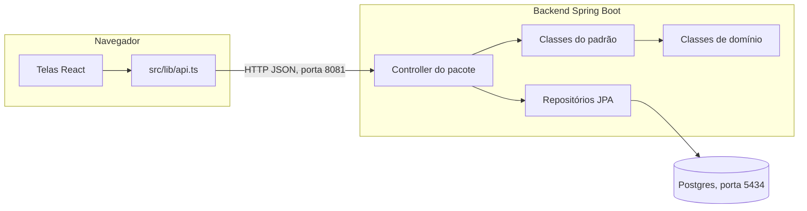
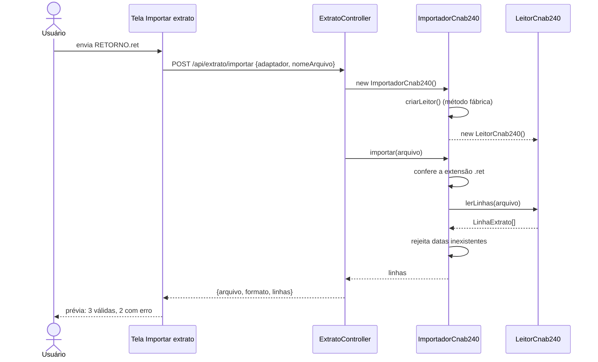
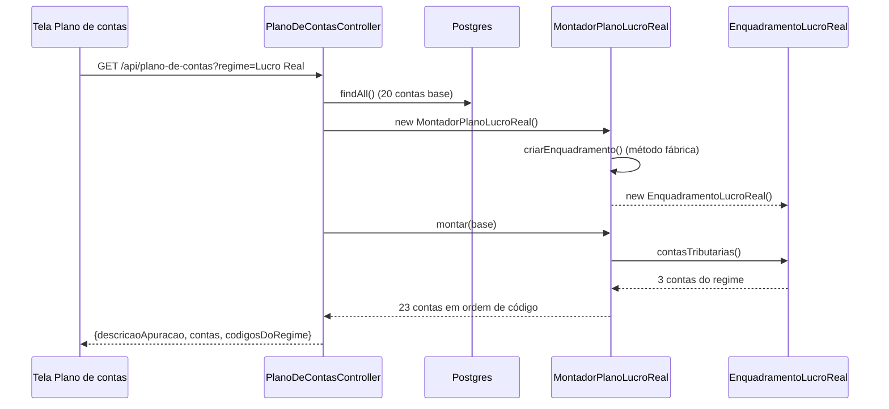
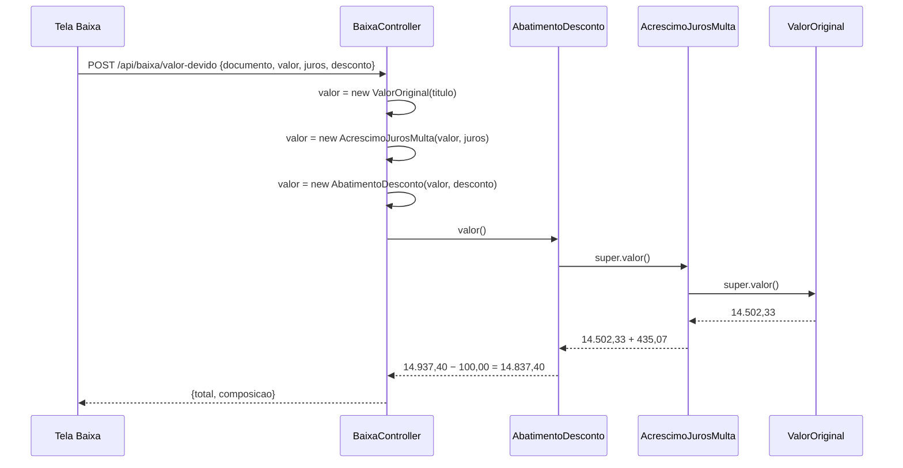
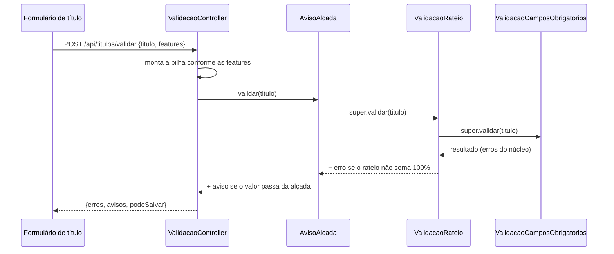
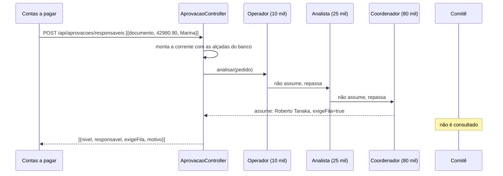
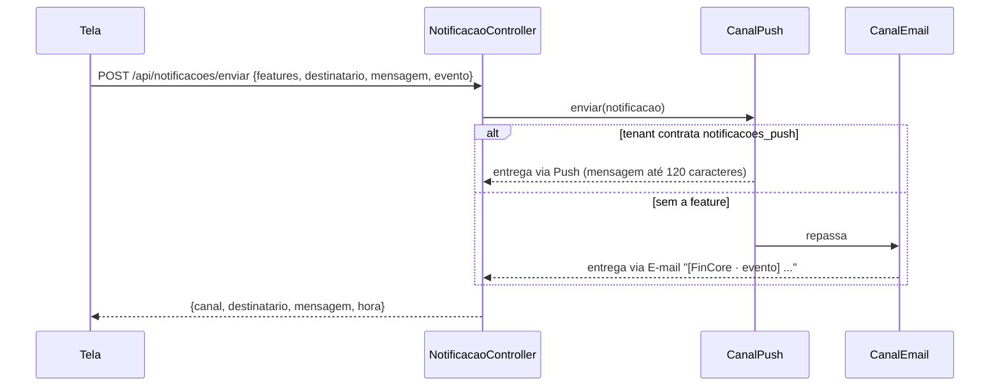

# FinCore ERP

Protótipo de ERP financeiro para PMEs brasileiras (contas a pagar, conciliação bancária,
aprovação por alçada, centros de custo e plano de contas). O mesmo sistema atende quatro
clientes (tenants) com escopos diferentes: telas, regras e integrações mudam conforme as
features contratadas por cada um.

Este repositório é o trabalho de **Reuso de Software**: três padrões de projeto do GoF, com
dois exemplos cada, aplicados em fluxos reais do sistema, sobre um conjunto de classes de
domínio.

| Requisito do trabalho                                                                | Onde está                                                                                         |
| ------------------------------------------------------------------------------------ | ------------------------------------------------------------------------------------------------- |
| Ao menos 10 classes principais, com atributos e métodos                              | 11 classes em `backend/.../dominio/` ([Classes de domínio](#classes-de-domínio))                  |
| Factory Method, 2 exemplos                                                           | Leitor de extrato e plano de contas ([Factory Method](#factory-method))                           |
| Decorator, 2 exemplos                                                                | Valor da baixa e validação do título ([Decorator](#decorator))                                    |
| Chain of Responsibility, 2 exemplos                                                  | Aprovação por alçada e canal de notificação ([Chain of Responsibility](#chain-of-responsibility)) |
| Item 02 (LPS): 2 telas de CRUD com banco por integrante (10), a partir de 3+ tabelas | 10 cadastros gravados no Postgres ([Cadastros](#cadastros-item-02))                               |
| Item 02 (LPS): exemplo de variabilidade planejada                                    | Features por tenant ([Tenants de exemplo](#tenants-de-exemplo))                                   |

## Sumário

- [Arquitetura](#arquitetura)
- [Estrutura do repositório](#estrutura-do-repositório)
- [Como rodar](#como-rodar)
- [Tenants de exemplo](#tenants-de-exemplo)
- [Classes de domínio](#classes-de-domínio)
- [Padrões de projeto](#padrões-de-projeto)
  - [Factory Method](#factory-method)
  - [Decorator](#decorator)
  - [Chain of Responsibility](#chain-of-responsibility)
- [Cadastros (item 02)](#cadastros-item-02)
- [Testes](#testes)
- [Roteiro de demonstração](#roteiro-de-demonstração)

## Arquitetura



- **Frontend** (`frontend/`): TanStack Start + React. Lê e grava os 10 cadastros pela API e
  chama a API sempre que uma tela precisa de uma regra dos padrões; a configuração dos tenants
  (features, adaptador, regime) e os dados de dashboard e relatórios continuam em memória.
- **Backend** (`backend/`): Spring Boot 4.1 com Java 21. Os fluxos dos padrões não guardam
  estado: cada requisição traz o que precisa (features do tenant, regime, adaptador, valores do
  formulário). Em cada
  pacote, o **controller é o cliente do padrão**: cria os objetos com `new`, monta a
  estrutura do padrão e devolve o resultado.
- **Banco** (Postgres via Docker, sem volume): guarda os 10 cadastros (13 tabelas), entre
  eles o plano de contas base e a escada de alçadas que os padrões leem. Os dados iniciais são
  recarregados pelo `data.sql` a cada subida.

## Estrutura do repositório

```
core-conta-flow/
  frontend/                      app React (telas, dados de exemplo, variabilidade)
    src/lib/api.ts               cliente da API: uma função por fluxo
    src/routes/                  telas (importar-extrato, plano-de-contas, baixa-pagamento...)
  backend/
    docker-compose.yml           Postgres na porta 5434
    src/main/resources/data.sql  plano de contas base + escada de alçadas
    src/main/java/com/fincore/
      dominio/                   11 classes de domínio + 2 repositórios
      extrato/                   Factory Method 1
      planodecontas/             Factory Method 2
      baixa/                     Decorator 1
      validacao/                 Decorator 2
      aprovacao/                 Chain of Responsibility 1
      notificacao/               Chain of Responsibility 2
    src/test/java/com/fincore/   um teste JUnit por padrão
  docs/                          specs e planos do trabalho
```

## Como rodar

Requisitos: Docker, Java 21, Maven 3.9 e Node.js.

```bash
cd backend
docker compose up -d      # Postgres na porta 5434 (sem volume)
mvn spring-boot:run       # API em http://localhost:8081/api
mvn test                  # testes dos padrões (não precisam do Docker)

cd ../frontend
npm install
npm run dev               # http://localhost:8080
```

Sem o backend, as telas abrem, mas os fluxos que usam os padrões mostram o aviso
"Backend indisponível em localhost:8081" e não deixam salvar.

## Tenants de exemplo

A empresa ativa é trocada pelo botão no topo da tela. As features de cada tenant podem ser
ligadas e desligadas em **Configurações → Features do tenant**, e os padrões reagem na hora.

| Tenant                   | Adaptador bancário | Regime           | Features relevantes para os padrões                          |
| ------------------------ | ------------------ | ---------------- | ------------------------------------------------------------ |
| Padaria Estrela do Sul   | OFX                | Simples Nacional | nenhuma                                                      |
| TransLog Cargas          | CNAB240            | Lucro Presumido  | `conciliacao`, `alcada`, `centro_custo`, `notificacoes_push` |
| Clínica Vida Plena       | OFX                | Simples Nacional | `conciliacao`, `alcada`, `centro_custo`, `notificacoes_push` |
| Metalúrgica Bandeirantes | CNAB400            | Lucro Real       | `conciliacao`, `alcada`, `centro_custo`, `notificacoes_push` |

## Classes de domínio

Pacote `com.fincore.dominio`. Todas têm atributos privados e getters, sem setters, e cada
método listado é usado por algum fluxo.

| Classe                | Atributos                                        | Métodos                              | Usada em               |
| --------------------- | ------------------------------------------------ | ------------------------------------ | ---------------------- |
| `ConfiguracaoTenant`  | features                                         | `possui(feature)`                    | validação, notificação |
| `TituloPagar`         | documento, parceiroId, vencimento, valor, rateio | `temValorPositivo()`                 | validação, baixa       |
| `Rateio`              | linhas                                           | `somaPercentual()`, `estaCompleto()` | validação              |
| `LinhaRateio`         | centroId, percentual                             | getters                              | validação              |
| `BaixaTitulo`         | juros, desconto                                  | `temJuros()`, `temDesconto()`        | baixa                  |
| `Alcada` (tabela)     | id, perfil, titular, limite                      | `exigeAprovacao(valor)`              | aprovação, validação   |
| `ContaPlano` (tabela) | id, codigo, descricao, nivel, tipo, saldo, grupo | getters                              | plano de contas        |
| `LinhaExtrato`        | linha, data, descricao, valor, tipo, erro        | `ehValida()`, `rejeitar(motivo)`     | extrato                |
| `ArquivoExtrato`      | nome, conteudo                                   | `temExtensao(ext)`, `registros()`    | extrato                |
| `Notificacao`         | destinatario, mensagem, evento                   | `resumo(limite)`                     | notificação            |
| `PedidoAprovacao`     | documento, valor, solicitante                    | `foiLancadoPor(usuario)`             | aprovação              |

`AlcadaRepository` e `ContaPlanoRepository` (Spring Data JPA) leem as duas tabelas.

## Padrões de projeto

O problema que cada padrão resolve e como ele resolve, com trechos do código, estão em
[Design_Patterns.md](Design_Patterns.md). Abaixo, os fluxos de cada exemplo.

| Padrão                  | Exemplo                         | Pacote          | Endpoint                                                             | Tela                                            |
| ----------------------- | ------------------------------- | --------------- | -------------------------------------------------------------------- | ----------------------------------------------- |
| Factory Method          | Leitor de extrato por adaptador | `extrato`       | `GET /api/extrato/formato/{adaptador}`, `POST /api/extrato/importar` | Importar extrato                                |
| Factory Method          | Plano de contas por regime      | `planodecontas` | `GET /api/plano-de-contas?regime=`                                   | Plano de contas, Onboarding                     |
| Decorator               | Valor devido na baixa           | `baixa`         | `POST /api/baixa/valor-devido`                                       | Baixa de pagamento                              |
| Decorator               | Validação do título por feature | `validacao`     | `POST /api/titulos/validar`                                          | Contas a pagar, Rateio                          |
| Chain of Responsibility | Aprovação por alçada            | `aprovacao`     | `POST /api/aprovacoes/responsaveis`                                  | Contas a pagar, Fila de aprovação               |
| Chain of Responsibility | Canal de notificação            | `notificacao`   | `POST /api/notificacoes/enviar`                                      | Contas a pagar, Fila de aprovação, Notificações |

---

### Factory Method

> Uma classe **criadora** define o fluxo de trabalho e declara um **método fábrica**; cada
> subclasse decide qual **produto** concreto criar. O fluxo é escrito uma vez só e funciona
> com qualquer produto.

#### Exemplo 1: leitor de extrato por adaptador bancário

**Problema.** Cada banco entrega o extrato num formato diferente (OFX, CNAB 240 ou CNAB 400),
mas o fluxo de importação é sempre o mesmo: aceitar só a extensão do adaptador, ler as
linhas, rejeitar datas inexistentes e devolver a prévia.

| Papel           | Classe                                                                                      |
| --------------- | ------------------------------------------------------------------------------------------- |
| Product         | `LeitorExtrato` (interface: `formato()`, `extensao()`, `descricao()`, `lerLinhas(arquivo)`) |
| ConcreteProduct | `LeitorOfx`, `LeitorCnab240`, `LeitorCnab400`                                               |
| Creator         | `ImportadorExtrato` (abstrata): chama `criarLeitor()` e implementa `importar(arquivo)`      |
| ConcreteCreator | `ImportadorOfx`, `ImportadorCnab240`, `ImportadorCnab400`                                   |
| Cliente         | `ExtratoController`: escolhe o importador pelo adaptador do tenant                          |

**Fluxo** (tela Importar extrato, tenant TransLog com CNAB240):

1. Ao abrir a tela, o frontend busca o formato do adaptador (`GET /extrato/formato/CNAB240`)
   para mostrar a extensão aceita (`.ret`) e o nome do arquivo de exemplo.
2. O usuário envia um arquivo. O frontend manda o adaptador e o nome do arquivo
   (`POST /extrato/importar`). O protótipo não lê o conteúdo enviado: o backend importa o
   arquivo de exemplo do adaptador (`AmostrasExtrato`) com o nome recebido.
3. O controller cria `ImportadorCnab240`. No construtor, o criador chama o método fábrica
   `criarLeitor()`, que devolve um `LeitorCnab240`.
4. `importar()` confere a extensão. Se estiver errada, responde 400 ("O adaptador CNAB240
   aceita apenas arquivos .ret").
5. O leitor converte cada registro de detalhe em `LinhaExtrato`, rejeitando valores
   ilegíveis. O criador rejeita as datas que não existem no calendário.
6. A tela mostra a prévia: linhas válidas, linhas com erro e o saldo do período.



**Reuso.** Um novo banco exige só um leitor e um importador novos; aceitar o arquivo, validar
datas e montar a prévia continua escrito uma única vez em `ImportadorExtrato`.

#### Exemplo 2: plano de contas por regime tributário

**Problema.** Todo tenant parte do mesmo plano de contas base, mas cada regime tributário
acrescenta contas de tributos próprias (DAS no Simples; IRPJ/CSLL e PIS/COFINS no Presumido
e no Real). O mesmo plano aparece em duas telas: Plano de contas e Onboarding.

| Papel           | Classe                                                                                                    |
| --------------- | --------------------------------------------------------------------------------------------------------- |
| Product         | `EnquadramentoTributario` (interface: `regime()`, `contasTributarias()`, `descricaoApuracao()`)           |
| ConcreteProduct | `EnquadramentoSimplesNacional` (1 conta), `EnquadramentoLucroPresumido` (2), `EnquadramentoLucroReal` (3) |
| Creator         | `MontadorPlanoDeContas` (abstrata): chama `criarEnquadramento()` e implementa `montar(base)`              |
| ConcreteCreator | `MontadorPlanoSimplesNacional`, `MontadorPlanoLucroPresumido`, `MontadorPlanoLucroReal`                   |
| Cliente         | `PlanoDeContasController`: lê a base no banco e escolhe o montador pelo regime                            |

**Fluxo** (tela Plano de contas, tenant Metalúrgica com Lucro Real):

1. A tela pede o plano do regime do tenant (`GET /plano-de-contas?regime=Lucro Real`).
2. O controller lê as 20 contas base no Postgres (`ContaPlanoRepository`).
3. O controller cria `MontadorPlanoLucroReal`, cujo método fábrica cria o
   `EnquadramentoLucroReal`.
4. `montar(base)` junta as contas base às 3 contas do regime e ordena por código.
5. A resposta traz o plano, a descrição da apuração e os códigos das contas do regime, que a
   tela destaca na árvore.
6. No **Onboarding**, a mesma chamada é feita para o regime escolhido; a tela mostra só as
   contas até o nível 2 e a descrição da apuração.



**Reuso.** O mesmo montador atende duas telas, e um novo regime é só mais um enquadramento e
um montador; a montagem do plano não muda.

---

### Decorator

> Um **decorador** tem a mesma interface do objeto que envolve, repassa a chamada para ele e
> acrescenta um comportamento. Decoradores podem ser empilhados em qualquer ordem e
> combinação, em tempo de execução.

#### Exemplo 1: valor devido na baixa de pagamento

**Problema.** O valor a pagar de um título pode receber juros/multa e desconto, em qualquer
combinação, e a tela precisa mostrar como o total foi composto.

| Papel             | Classe                                                                          |
| ----------------- | ------------------------------------------------------------------------------- |
| Component         | `ValorAPagar` (interface: `valor()`, `composicao()`)                            |
| ConcreteComponent | `ValorOriginal`: o valor do título, sem ajustes                                 |
| Decorator         | `AjusteDeValor` (abstrata): guarda o componente envolvido e repassa as chamadas |
| ConcreteDecorator | `AcrescimoJurosMulta`, `AbatimentoDesconto`                                     |
| Cliente           | `BaixaController`: envolve o valor com um decorador por ajuste informado        |

**Fluxo** (tela Baixa de pagamento, título NF-20491 de R$ 14.502,33):

1. Sempre que o usuário muda o título, os juros ou o desconto, a tela pede o valor devido
   (`POST /baixa/valor-devido`).
2. O controller cria `ValorOriginal(título)`.
3. Se há juros (`BaixaTitulo.temJuros()`), envolve com `AcrescimoJurosMulta`; se há desconto
   (`temDesconto()`), envolve de novo com `AbatimentoDesconto`.
4. `valor()` e `composicao()` percorrem as camadas de fora para dentro, e cada camada soma ou
   subtrai o seu ajuste e acrescenta a sua linha à composição.
5. A tela mostra a composição e o total (R$ 14.502,33 + R$ 435,07 − R$ 100,00 =
   R$ 14.837,40). A baixa só pode ser confirmada com o total atualizado.



**Reuso.** Cada ajuste é uma classe pequena e independente; um novo tipo de ajuste (por
exemplo, correção monetária) entra sem mexer nos existentes.

#### Exemplo 2: validação do título conforme as features

**Problema.** Todo título passa pelas regras do núcleo (documento, fornecedor, vencimento e
valor). Tenants com `centro_custo` também exigem rateio de 100%, e tenants com `alcada`
recebem um aviso quando o valor passa do limite do operador. As regras extras dependem do
que cada tenant contratou.

| Papel             | Classe                                                                       |
| ----------------- | ---------------------------------------------------------------------------- |
| Component         | `ValidadorTitulo` (interface: `validar(titulo)`)                             |
| ConcreteComponent | `ValidacaoCamposObrigatorios`: regras do núcleo                              |
| Decorator         | `ValidacaoDecorator` (abstrata): repassa ao validador envolvido              |
| ConcreteDecorator | `ValidacaoRateio` (feature `centro_custo`), `AvisoAlcada` (feature `alcada`) |
| Apoio             | `ResultadoValidacao`: erros por campo, avisos e `podeSalvar()`               |
| Cliente           | `ValidacaoController`: empilha os decoradores conforme as features           |

**Fluxo** (formulário de Contas a pagar, tenant TransLog):

1. A cada alteração do formulário, a tela envia o título e as features do tenant
   (`POST /titulos/validar`).
2. O controller cria `ValidacaoCamposObrigatorios`. Se `ConfiguracaoTenant.possui("centro_custo")`,
   envolve com `ValidacaoRateio`; se possui `alcada`, envolve com `AvisoAlcada`, usando a
   primeira alçada do banco (R$ 10.000,00).
3. Cada camada chama a de dentro e acrescenta o seu erro ou aviso ao mesmo
   `ResultadoValidacao`.
4. A tela mostra os erros e avisos e só habilita "Lançar título" quando `podeSalvar` é
   verdadeiro para o texto atual do formulário.
5. A tela **Rateio** reusa o mesmo endpoint mandando só `centro_custo`, e considera apenas os
   erros do campo `rateio`.



| Features ligadas   | Pilha montada            | Exemplo com R$ 12.000 e rateio 70% + 20% |
| ------------------ | ------------------------ | ---------------------------------------- |
| nenhuma (Padaria)  | núcleo                   | pode salvar                              |
| só `centro_custo`  | núcleo → rateio          | erro de rateio                           |
| só `alcada`        | núcleo → alçada          | aviso de alçada, pode salvar             |
| as duas (TransLog) | núcleo → rateio → alçada | erro de rateio + aviso de alçada         |

**Reuso.** A mesma `ValidacaoRateio` serve ao formulário de títulos e à tela de rateio, e uma
nova feature com regra própria é só mais um decorador.

---

### Chain of Responsibility

> Um pedido percorre uma **corrente de tratadores**. Cada elo decide se assume o pedido; se
> não assume, repassa ao próximo. Quem envia o pedido não sabe qual elo vai tratá-lo.

#### Exemplo 1: aprovação escalonada por alçada

**Problema.** Um título deve ser decidido pelo primeiro nível da escada que tenha limite
para o valor. Acima de todos os níveis, quem decide é o comitê. Se quem lançou é o próprio
responsável pelo nível, o título entra direto, sem fila.

| Papel           | Classe                                                                                                           |
| --------------- | ---------------------------------------------------------------------------------------------------------------- |
| Handler         | `AprovadorDeTitulo` (abstrata): `encadear(proximo)`, `analisar(pedido)`, e os abstratos `assume()` e `decidir()` |
| ConcreteHandler | `AprovadorPorAlcada` (um por nível da escada), `ComiteFinanceiro` (elo final)                                    |
| Request         | `PedidoAprovacao` (documento, valor, solicitante)                                                                |
| Resposta        | `DecisaoAprovacao` (nível, responsável, exigeFila, motivo)                                                       |
| Cliente         | `AprovacaoController`: monta a corrente com as alçadas do banco                                                  |

Escada (tabela `alcada`):

| Nível               | Titular                              | Limite        |
| ------------------- | ------------------------------------ | ------------- |
| Operador financeiro | Marina Duarte                        | R$ 10.000,00  |
| Analista financeiro | Renata Oliveira                      | R$ 25.000,00  |
| Coordenador         | Roberto Tanaka                       | R$ 80.000,00  |
| Diretor financeiro  | Carlos Eduardo Menezes               | R$ 500.000,00 |
| Comitê financeiro   | Carlos Eduardo Menezes + Paula Nunes | acima de tudo |

**Fluxo** (Marina lança um título de R$ 42.980,90 na TransLog):

1. Ao clicar em "Lançar título", a tela envia o pedido (`POST /aprovacoes/responsaveis`).
2. O controller lê as alçadas em ordem de limite e encadeia um `AprovadorPorAlcada` por
   nível, com o `ComiteFinanceiro` no fim.
3. O pedido entra no primeiro elo. Operador (10 mil) e Analista (25 mil) não assumem e
   repassam. O Coordenador (80 mil) assume.
4. Como quem lançou (Marina) não é o titular (Roberto), a decisão exige fila, com o motivo
   "acima da alçada de quem lançou — encaminhado a Roberto Tanaka".
5. O título entra como "Aprovação pendente", a auditoria grava o motivo, e o aviso ao
   responsável segue pela corrente de notificação (exemplo 2).
6. A **Fila de aprovação** envia todos os pendentes numa chamada só e mostra, em cada card,
   quem decide e por quê.



| Valor lançado pela Marina    | Quem decide                 | Fila? |
| ---------------------------- | --------------------------- | ----- |
| até R$ 10.000,00             | Operador (a própria Marina) | não   |
| R$ 10.000,01 a R$ 25.000,00  | Analista (Renata)           | sim   |
| R$ 25.000,01 a R$ 80.000,00  | Coordenador (Roberto)       | sim   |
| R$ 80.000,01 a R$ 500.000,00 | Diretor (Carlos Eduardo)    | sim   |
| acima de R$ 500.000,00       | Comitê (2 assinaturas)      | sim   |

Sem a feature `alcada` (Padaria), a corrente não é consultada e o título entra em aberto.

**Reuso.** A escada vem do banco: um novo nível é uma linha a mais na tabela, sem mudar
código. Os mesmos elos atendem o lançamento e a fila de aprovação.

#### Exemplo 2: canal de envio da notificação

**Problema.** Avisos (título aguardando aprovação, título devolvido, teste) devem sair pelo
melhor canal disponível no tenant: Push quando o tenant contrata `notificacoes_push`, e-mail
como garantia de entrega.

| Papel           | Classe                                                                                                                            |
| --------------- | --------------------------------------------------------------------------------------------------------------------------------- |
| Handler         | `CanalNotificacao` (abstrata): `encadear(proximo)`, `enviar(notificacao)`, e os abstratos `nome()`, `disponivel()` e `formatar()` |
| ConcreteHandler | `CanalPush` (só com `notificacoes_push`; corta a mensagem em 120 caracteres), `CanalEmail` (elo final; sempre entrega)            |
| Request         | `Notificacao` (destinatário, mensagem, evento)                                                                                    |
| Resposta        | `EnvioNotificacao` (canal, destinatário, mensagem formatada, hora)                                                                |
| Cliente         | `NotificacaoController`: monta Push → E-mail                                                                                      |

**Fluxo** (título enviado para aprovação na TransLog):

1. Depois de lançar um título que exige fila, a tela envia o aviso ao responsável, com as
   features do tenant (`POST /notificacoes/enviar`). O mesmo acontece ao devolver um título
   e no botão "Enviar notificação de teste" da tela Notificações.
2. O controller encadeia `CanalPush` → `CanalEmail`.
3. `CanalPush` verifica `ConfiguracaoTenant.possui("notificacoes_push")`. Na TransLog está
   disponível, então entrega e encerra a corrente.
4. Na Padaria, sem a feature, o Push repassa e o `CanalEmail` entrega, prefixando
   `[FinCore · evento]`.
5. A tela mostra por qual canal o aviso saiu.



**Reuso.** Um novo canal (por exemplo, SMS) é um elo a mais na corrente; quem envia o aviso
não muda.

## Cadastros (item 02)

Dez telas de CRUD gravam no Postgres pelo mesmo mecanismo genérico:

- **Backend:** `CrudController<T>` (`backend/.../cadastro/`) implementa listar (`GET`), criar
  (`POST`), editar (`PUT /{id}`) e excluir (`DELETE /{id}`) sobre um repositório Spring Data JPA.
  Cada cadastro é uma entidade, um repositório de uma linha e um controller que só declara a
  rota.
- **Frontend:** `useCadastro(recurso)` (`frontend/src/lib/use-cadastro.ts`) lista e grava pela
  API; `FormularioCadastro` e `TelaCadastro` montam o formulário e a tela a partir de uma lista
  de campos.

| Integrante | Cadastro                | Tela                  | Recurso da API            | Tabela                                                          |
| ---------- | ----------------------- | --------------------- | ------------------------- | --------------------------------------------------------------- |
| 1          | Clientes e fornecedores | `/parceiros`          | `/api/parceiros`          | `parceiro` (+ `parceiro_historico`)                             |
| 1          | Usuários                | `/usuarios`           | `/api/usuarios`           | `usuario`                                                       |
| 2          | Contas a pagar          | `/contas-a-pagar`     | `/api/contas-pagar`       | `conta_pagar` (+ `conta_pagar_rateio`, `conta_pagar_historico`) |
| 2          | Formas de pagamento     | `/formas-pagamento`   | `/api/formas-pagamento`   | `forma_pagamento`                                               |
| 3          | Contas a receber        | `/contas-a-receber`   | `/api/contas-receber`     | `conta_receber`                                                 |
| 3          | Contas bancárias        | `/contas-bancarias`   | `/api/contas-bancarias`   | `conta_bancaria`                                                |
| 4          | Centros de custo        | `/centros-de-custo`   | `/api/centros-custo`      | `centro_custo`                                                  |
| 4          | Categorias de despesa   | `/categorias-despesa` | `/api/categorias-despesa` | `categoria_despesa`                                             |
| 5          | Plano de contas         | `/plano-de-contas`    | `/api/contas-plano`       | `conta_plano`                                                   |
| 5          | Alçadas                 | `/alcadas`            | `/api/alcadas`            | `alcada`                                                        |

Os cadastros alimentam o resto do sistema: categorias no lançamento de títulos, contas
bancárias e formas de pagamento na baixa, usuários como responsáveis e titulares, centros de
custo nos rateios. A tabela `alcada` é a mesma que a corrente de aprovação lê: **editar ou criar
um nível em /alcadas muda na hora quem decide cada título**.

Os dados iniciais vêm do `backend/src/main/resources/data.sql` e são recarregados a cada subida
do backend (o Postgres roda sem volume).

## Testes

`mvn test` (pasta `backend/`) roda 17 testes JUnit: 12 dos padrões (sem Spring e sem banco) e 5 de
integração dos cadastros (`CadastroTest`, com MockMvc e banco H2 em memória):

| Classe                      | O que verifica                                                                                                                                                                                                                                     |
| --------------------------- | -------------------------------------------------------------------------------------------------------------------------------------------------------------------------------------------------------------------------------------------------- |
| `FactoryMethodTest`         | cada importador cria o seu leitor; os 3 formatos leem os mesmos lançamentos; linhas com valor ilegível e data inexistente são rejeitadas; extensão errada é recusada; o Lucro Real acrescenta 3 contas em ordem de código                          |
| `DecoratorTest`             | juros e desconto envolvem o valor original com a composição certa; rateio incompleto gera erro e valor acima da alçada gera aviso; sem decoradores só atuam as regras do núcleo                                                                    |
| `ChainOfResponsibilityTest` | valor no limite fica com o próprio operador; acima dele sobe para o analista; acima de tudo vai ao comitê; Push com a feature e e-mail sem ela; o push corta mensagens longas                                                                      |
| `CadastroTest`              | ciclo completo do CRUD genérico (formas de pagamento); título a pagar volta do banco com rateio, baixa e histórico; a baixa gravada pela API volta do banco; um nível de alçada novo muda quem decide; sem alçadas, o comitê decide e não há aviso |

## Roteiro de demonstração

Com backend e frontend no ar:

1. **Factory Method 1:** escolha a TransLog e abra Importar extrato. Use o arquivo de
   exemplo (CNAB240: 3 linhas válidas, 2 com erro). Troque para a Metalúrgica (CNAB400) ou a
   Clínica (OFX) e repita: mesmo fluxo, leitor diferente. Envie um arquivo com a extensão
   errada para ver a recusa.
2. **Factory Method 2:** abra Plano de contas na Padaria, na TransLog e na Metalúrgica (21, 22
   e 23 contas, com as do regime destacadas). No Onboarding, troque o regime no passo 1 e veja
   o passo 2 mudar.
3. **Decorator 1:** em Contas a pagar, abra a baixa do NF-20491 e informe juros e desconto; a
   caixa "Total calculado" mostra uma linha por decorador.
4. **Decorator 2:** na TransLog, crie uma conta de R$ 12.000 com rateio de 70% + 20% (erro de
   rateio e aviso de alçada). Em Configurações, desligue `alcada` ou `centro_custo` e repita
   para ver a pilha mudar.
5. **Chain of Responsibility 1:** na TransLog, lance contas de R$ 5.000, R$ 42.980,90 e
   R$ 600.000 e abra a Fila de aprovação para ver quem decide cada uma.
6. **Chain of Responsibility 2:** em Notificações, clique em "Enviar notificação de teste" na
   TransLog (Push) e na Padaria (E-mail), ou desligue `notificacoes_push` na TransLog.

Detalhes do frontend (rotas, perfis de acesso e variabilidade por tenant) estão em
[frontend/README.md](frontend/README.md); o backend tem um resumo próprio em
[backend/README.md](backend/README.md).
